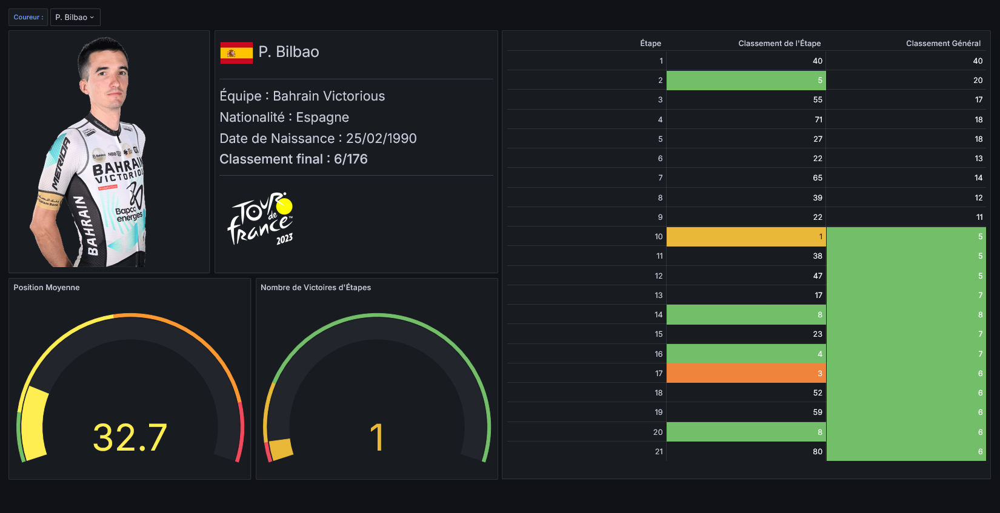

# Tour de France 2023

---

## Présentation générale

Visualisation d'une partie des données du Tour de France 2023 à l'aide d'une base de données **MySQL** et de **Grafana**.
Les dashboards Grafana permettent de visualiser :
- les informations générale du Tour de France 2023
- les coureurs et leurs classements
- les informations d'une étape

---

## Démonstration

### Global

---

### Coureurs

|||||
|-|-|-|-|
|||||
|||||
|||||
|||||
|||||
|||||
|||||

---

### Etapes

||||
|-|-|-|
||||
||||
||||
||||
||||
||||

## Installation
Afin de pouvoir visualiser ces données, il est nécessaire d'avoir un serveur disposant de MySQL et de Grafana.  
Tous les fichiers présents dans le dossier [bdd](bdd/) doivent être importés dans la base de données MySQL.
Les fichiers du dossier [grafana](grafana/) doivent être importés dans Grafana en tant que dashboards.
> [!IMPORTANT]
> Toutes les occurences de `NOM_BDD` dans les fichiers de grafana doivent être remplacées par le nom de la base de données dans laquelle les données ont été importé.
